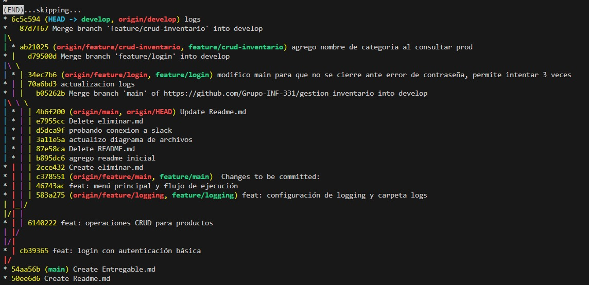
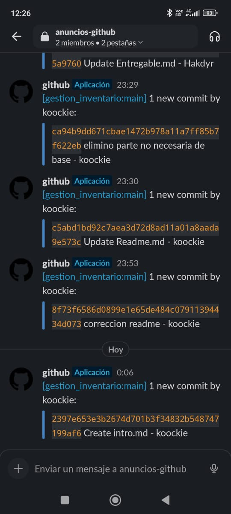
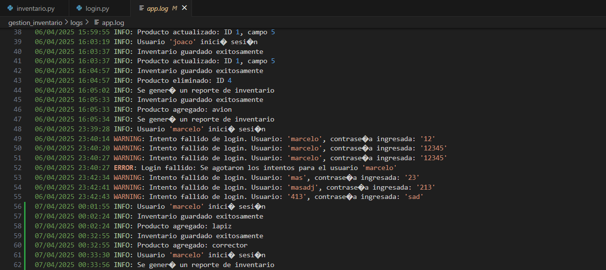

# Gestión de Inventario para Bodega

**Integrantes del equipo:** Joaquin Aguilera, Marcelo Fernandez

**Fecha:** 06/04/2025

**Enlace al repositorio GitHub (público):** https://github.com/Grupo-INF-331/gestion_inventario

---

## ✅ 1. Especificación del Requerimiento
### 1.1 Validación (¿Estamos construyendo lo que el usuario necesita?)

- Definir de manera más clara el control de inventario dentro de la aplicación

- Se delimitó el alcance: no es un sistema POS completo, sino un programa sencillo de inventario. Las funcionalidades necesarias para el usuario existen y funcionan, por lo que satisface las necesidades del cliente.

#### Supuestos:

- La autenticación puede ser básica (login por username y password, sin roles).

- No se requiere despliegue en la nube

- El sistema será de escritorio (sin visual y por medio de una línea de comandos)

- No se requiere integración con hardware (ej. lector de códigos).

- La categoría es seleccionable desde un set predefinido (el usuario debe elegir indicando el número de la opción).

### 1.2 Verificación (¿Estamos construyéndolo correctamente?)
- Plan de pruebas dividido en ciclos (como se detalla más abajo).

- Cada funcionalidad del CRUD será testeada con entradas válidas e inválidas.

- Se probará autenticación con credenciales correctas e incorrectas.

- Se validarán los log generados con datos de prueba que se almacenarán en un archivo llamado app.log.

---

## 🧠 2. Organización del Proyecto
### Estructura del Proyecto
Mediante el uso de Python + Flask:

```arduino

gestion_inventario/
│
├── main.py                     # Punto de entrada de la aplicación
├── login.py                   # Funciones de login y autenticación
├── inventario.py              # Funciones CRUD para inventario
├── utils.py                   # Funciones auxiliares como logging
├── logs/                      # Carpeta para guardar los archivos de log
│   └── app.log
└── data/                      # Carpeta para los .txt (almacenamiento local)
    ├── usuarios.txt
    └── inventario.txt

```
### Flujo de Trabajo

- **Ramas Git**:
  - `main`: protegida, estable
  - `dev`: integración
  - `feature/*`: nuevas funcionalidades
- **Slack**: Integrado con GitHub para visualizar commits, PRs, merges.
- **Paradigma Git Flow**: Separación clara de desarrollo y producción.

---

## 🖥️ 3. Codificación

### Lenguaje: Python

### Funcionalidades:

- **CRUD de productos**
- **Autenticación simple**
- **Gestión de stock** (incrementar/disminuir cantidad)
- **Búsqueda y filtrado** por nombre y categoría
- **Reportes**:
  - Total de productos
  - Valor total del inventario (`precio_unitario * cantidad`)
  - Productos agotados (`cantidad == 0`)

Extras Técnicos:
Manejo de excepciones (ej. productos sin nombre, duplicados, etc.)

Logging con logging de Python

- Archivo `README.md` incluye:
- Nombre
- Descripción
- Instalación
- Cómo usar
- Cómo contribuir
- Licencia

---

## 🧪 4. Pruebas

### Estrategia

- Pruebas individuales (Ciclo 1)
- Pruebas cruzadas en equipo (Ciclo 2) - Merge del avance individual de cada integrante
- Pruebas adicionales si es necesario (Ciclo 3)
- Herramienta: pruebas manuales
- Registro: Excel o app.greentest.ai

### Pruebas:

| Id_Test | Entrada                         | Resultado Esperado               | Resultado Obtenido         | Éxito/Fallo | Comentario              |
|---------|----------------------------------|----------------------------------|-----------------------------|--------------|--------------------------|
| T001    | Crear producto con nombre vacío        | Rechaza producto                 | Rechaza producto            | ✅            | Validación funciona       |
| T002    | Login con credenciales válidas   | Acceso permitido                 | Acceso permitido            | ✅            |                          |
| T003    | Reporte con inventario vacío     | Total productos: 0 Valor total del inventario: $0.00 Productos agotados: Ninguno| Total productos: 0 Valor total del inventario: $0.00 Productos agotados: Ninguno | ✅      |                          |
| T004    | Crear producto con precio inválido       | Rechaza producto                 | Rechaza producto            | ✅            | Validación funciona       |
| T005    | Asignar precio negativo       | Pide re ingresar valor              | Pide reingresar valor           | ✅            | Control funciona   |

[Entorno en greentest.ai]((img_entregable/image1.png)
#### Sobre la experiencia de usuario usando greentest.ai:
- Fue díficil entender las funcionalidades y el uso que se le debe de dar al programa, como opinión personal de usuario inexperto, falta una guía o un tutorial de como usar el software, aunque después de 1 hora explorando las opciones el entorno se volvió mas amigable y se entiende que es lo que hace el software, como equipo no tuvimos la certeza de lo que realmente hacía o funcionaban los entornos de testeo, pensando en un comienzo que consistía en subir un proyecto a la web y ejecutarlo dandole diferentes entradas. Las opciones son bastante sencillas, pero la interacción con algunas opciones, como por ejemplo al agregar una sexta prueba dice que la prueba 6 fue creada localmente, pero no se muestra en el dashboard junto a las demás, haciendo que se vuelva confuso el como acceder a dicha prueba nueva. 

---

## ⚠️ 5. Problemas Encontrados y Soluciones

- ❌ Error en validación de cantidades negativas → ✅ Se agregó validación extra.
- ❌ Error en login (se cerraba el programa si el login fallaba) → ✅ Se agregó un ciclo que pide ingresar credenciales hasta que sean válidas.
- ❌ Error en validación de datos nulos → ✅ Se agregó validación extra.

---

## 📎 Extras

- [ ] Pruebas documentadas en [app.greentest.ai](https://app.greentest.ai)
- [ ] Capturas de:
- Pull requests

- Slack mostrando commits
  

- Aplicación funcionando

- Logs


---

## 📌 Licencia

Este proyecto está licenciado bajo la licencia MIT. Ver archivo [LICENSE](LICENSE) para más detalles.
